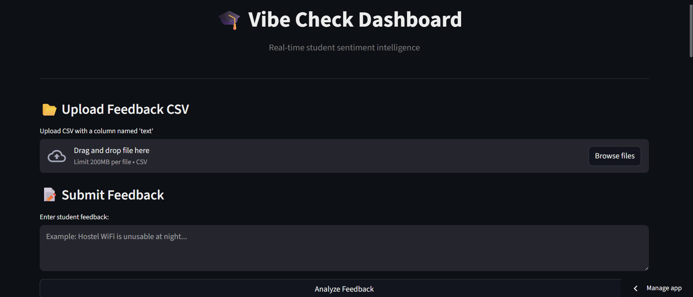
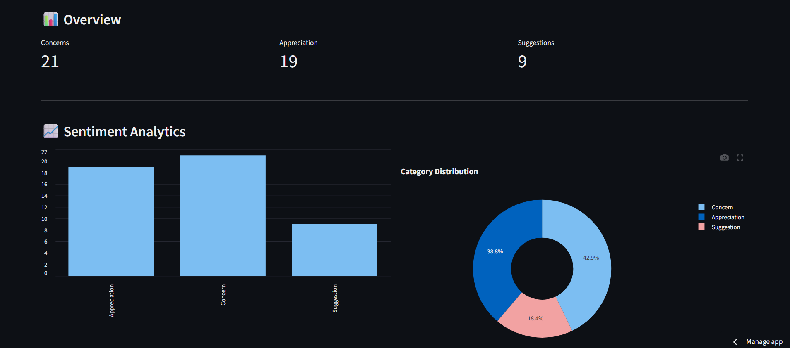
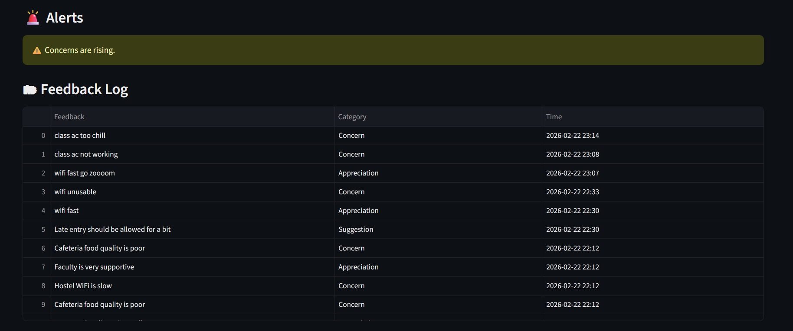

## 1. Project Overview

**Project Name:** The "Vibe Check" Dashboard (Sentiment Analysis)  
**Team ID:** Cachers  

**One-Liner:**  
A cloud-native dashboard that converts student feedback into real-time sentiment insights for smarter campus decisions.

**Live Demo Link:**  
https://vibe-check-nlp-cloudypfztxfpsujlmbu8xqxfks.streamlit.app/

## 2. Technical Architecture

**Cloud Provider:** Render (API Hosting), Streamlit Community Cloud (Dashboard), Supabase Cloud Platform  
**Frontend:** Streamlit (Python-based interactive dashboard)  
**Backend:** FastAPI (Python microservice for AI inference)  
**Database:** Supabase PostgreSQL (cloud-hosted relational database)

---

## System Architecture

  

Figure: Cloud-native architecture showing frontend, backend, AI inference, and database layers.

---

## 3. Proof of "Zero-Cost" Cloud Usage

### Free-tier services used:

- **Render Free Tier** → hosts FastAPI backend
- **Streamlit Community Cloud** → hosts live dashboard
- **Supabase Free Tier** → PostgreSQL database & API
- **Groq Free API Tier** → LLM inference for sentiment classification
- **GitHub** → code hosting & CI integration

### Handling 800+ Concurrent Users

Our architecture is designed for scalability and reliability:

- The FastAPI backend is deployed on Render, which automatically manages traffic load and isolates requests.
- The AI inference layer processes requests independently, allowing parallel handling of multiple feedback submissions.
- Supabase PostgreSQL efficiently supports concurrent read/write operations with connection pooling.
- The Streamlit dashboard serves users independently while retrieving data directly from the cloud database.

This distributed architecture ensures smooth performance under high user load.

---

## Sentiment Classification Design

Our system performs fine-grained feedback classification to capture nuanced student sentiment.

### Detailed Categories Deteced
- Concerns  
- Complaints  
- Suggestions  
- Questions  
- Appreciation  
- Positive Feedback  
- Negative Feedback  
- Neutral / Other  

### Actionable Insight Grouping

To improve decision-making and visualization clarity, related categories are grouped in the analytics dashboard:

- **Issues & Negative Sentiment**
  - Concerns
  - Compla ints
  - Negative Feedback

- **Positive Sentiment**
  - Appreciation
  - Positive Feedback

- **Improvement & Engagement**
  - Suggestions
  - Questions

- **Neutral**
  - Neutral / Other

This layered approach preserves detailed sentiment insights while presenting administrators with clear, actionable trends.

---

## 4. Important Links

**Live Demo Link:**  
https://vibe-check-nlp-cloudypfztxfpsujlmbu8xqxfks.streamlit.app/

**GitHub Repository:**  
https://github.com/persistent-amd/vibe-check.git

---

## Live Dashboard Preview

  

---

## Sentiment Analytics (Real-Time Insights)

  

---

## Feedback Log & Historical Data

  

## Known Limitations

Requires internet connectivity for AI inference

Cold start delay may occur on free-tier hosting

## Future Improvements

Word cloud visualization

Multi-language support

Admin alert notifications

Role-based access control